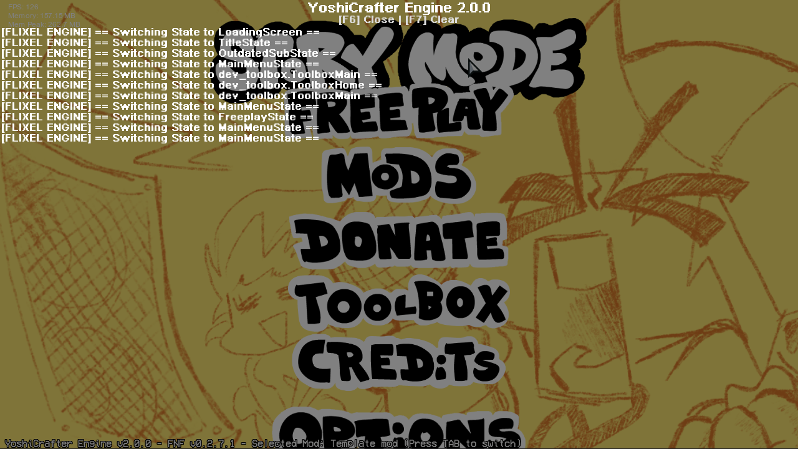

# Logging System
## How does it work?

By pressing F6, you can open a logging overlay. This overlay will show every flixel logs, along with everything you've traced in your [scripts](../scripting/index.md).

The logging system have multiple controls, such as:
- [F6] Close the overlay.
- [F7] Clear the logs.

Please note that it is not available outside of developer mode, and in locked mods.

## How are flixel events logged?

Every method of `FlxG.log` has been redirected to the log system. That means that you can see Flixel errors, warnings and notices.

These can be differentiated by a prefix.
- `[FLIXEL]` Basic Flixel logs.
- `[FLIXEL WARNING]` Flixel Warning.
- `[FLIXEL ERROR]` Flixel Errors, such as missing assets, and such.
- `[FLIXEL ENGINE]` Additional logging such as state switching.

