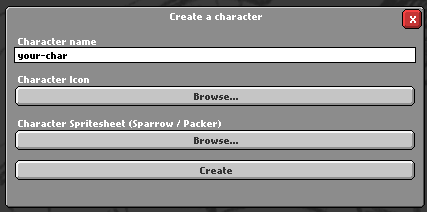

# Character Tab
## Create a new Character

To create a new Character, click on the "Create" button at the bottom of the screen.

A "Create a Character" window will pop up.

In this window, you'll need to enter a few parameters, such as:
- Character Name: The name of your character.
- Character Icon: A grid of 150x150 icons.
- Character Spritesheet: A spritesheet of your character.

A new folder with your character will be created in the `characters`, containing a basic script that loads the JSON, and the required assets.

If you want to make advanced characters, you can check the Character.hx documentation [here](/scripts/characterScript.md).

## Preview Character

To preview a Character, select the character, then click the "Preview" button.

The previewed character will pop-up.